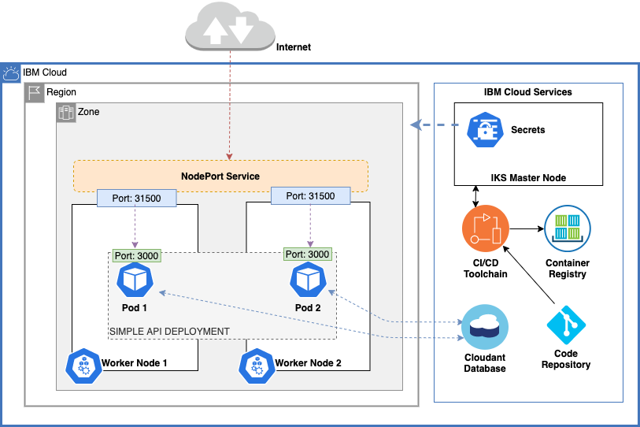
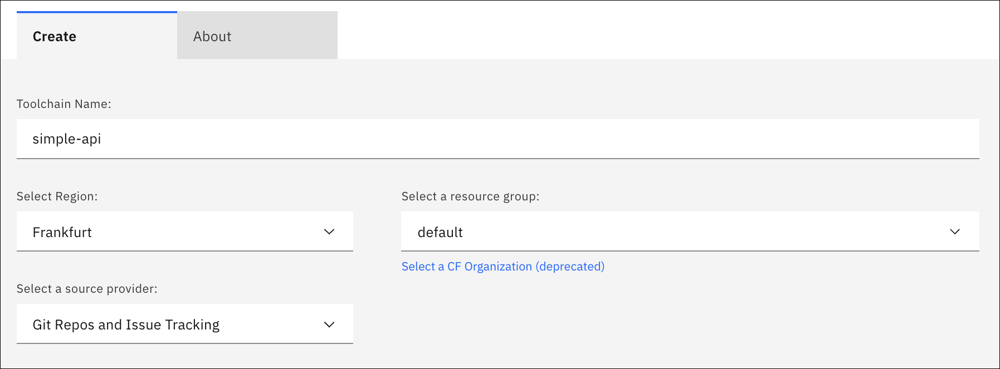
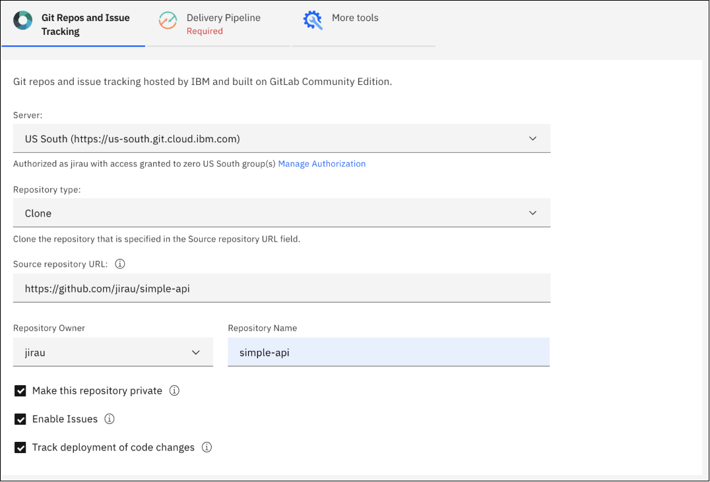
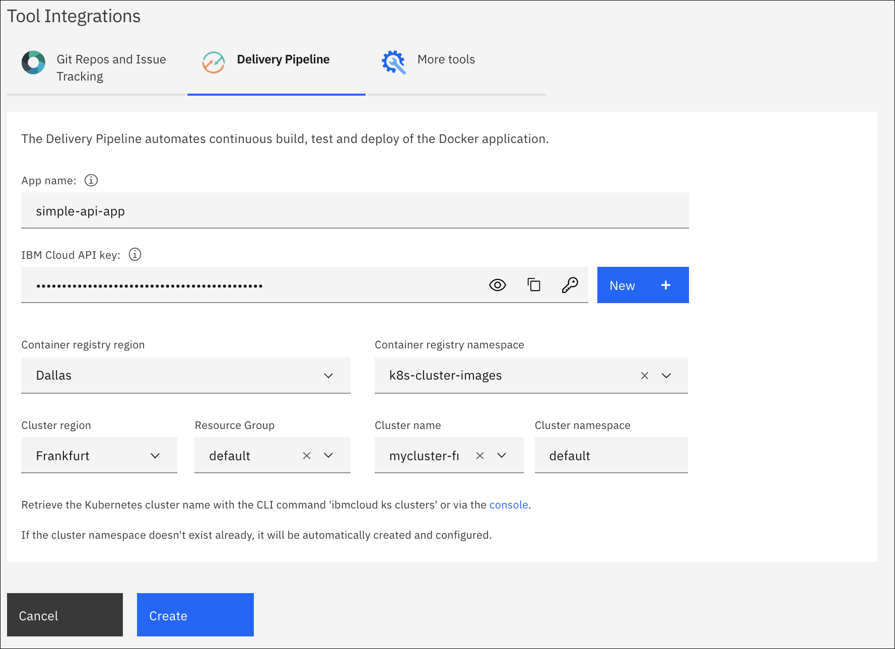
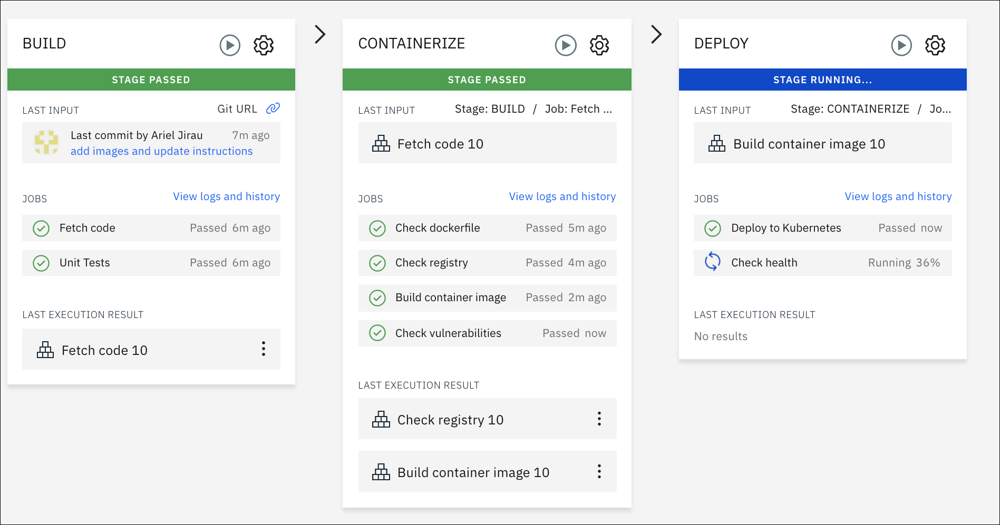
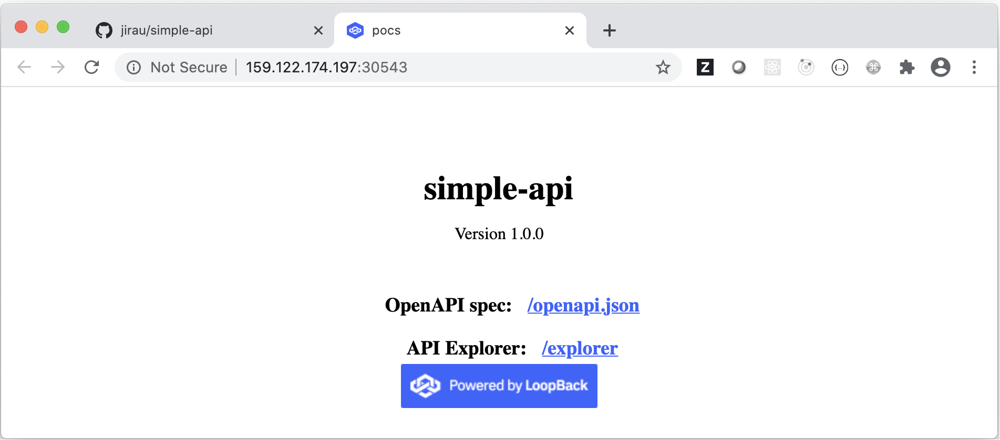

### Tutorial: Deploying a cloud-native microservice in the IBM Kubernetes Service, going beyond deploying a Hello World application container.

Continuous integration and continuous delivery (CI/CD) models and technologies have become a critical aspect for enterprises adopting DevOps and cloud-native development. Complexities, skill and knowledge gaps can be significant inhibitors for entry and for adoption at a larger scale.
Pipeline tools that provide CI/CD automation, ease of configuration and operation allows application developers to efficiently embrace and incorporate these tools into their projects.

By following this tutorial, you will be able to exercise all the steps necessary to deploy a fully functional cloud-native microservice in the IBM Kubernetes Service (IKS) by leveraging IBM Cloud's toolchain automation tools.

**Prerequisites**
* You will need an IBM Cloud Account. If you don't have one, you can sign up for a free [trial](https://cloud.ibm.com/).
* Verify that toolchains and tool integrations are available in your region and IBM Cloud environment.
* You will need a IBM Kubernetes Service cluster (IKS). At the time of this writing, IBM Cloud offers a 30 days free trial on IKS clusters.
* You will need to provision an instance of the IBM Cloudant Database service. A Lite tier which it is free is also available.

For this tutorial, we will be deploying a simple cloud-native api, using the IBM Cloud toolchain to containerize, store the image on a Cloud based private container registry and then deploy it to our target Kubernetes cluster.

We will use the code stored in this repository as our sample microservice, which we will refer to as the **simple-api**.
The simple-api is a basic nodejs microservice that exposes data via a http RESTful API. The API is based on the loopback4 framework. A simple data model with the name 'items' is included for testing purposes. You can find more information about the loopback framework [here](https://loopback.io/). In conjunction with the api, an IBM Cloud Cloudant Database is also needed and used as our data store, where we will store our 'item' records.
The following diagram depicts how our micro-service environment will look like after our automated deployment is completed.




To start, we will need to provision our Database service.

### Step 1: Provisioning and Configuring the IBM Cloudant Service
1. Log into your IBM Cloud Account
1. From the dashboard, click **| Create Resource+ |**
1. Use the **| Search the catalog.. |** bar and search for *Cloudant*
1. Click on the *Cloudant Service box* option
1. Change the Authentication method from IAM, to **IAM and legacy credentials**
1. Ensure Lite plan is selected (note: this is a free tier plan)
1. Leave all the other service options unchanged
1. Click **| Create |** on the lower right side of the screen

Next, we will need to create the necessary Cloudant service credentials, to allow our simple-api to read, write, delete our data.
1. On the Cloudant service page, click on Service Credentials
1. Then click, **| New Credentials+ |**

1. On the Create credentials, select *Writer* as the Role: (Note: see the following diagram for the 3 credential elements that will be used on the next step to configure our Kubernetes deployment secrets and environment variables)


To finalize our Database configuration, we must create a Database, which will be exposed by our simple-api container.
1. On the Cloudant service page, click on Manage, and then click on the Launch Dashboard button and log with your IBMid credentials.
1. On the Database section of the Cloudant Dashboard, click on **| Create Database |** on the upper toolbar.
1. On the Create Database window, enter **'items'** (ensure all lower caps) as the Database name, click on the *Non-Partitioned radio button*, then click the **| Create |** button.
1. You can now close the dashboard, as no other steps are needed related to the Cloudant Database service.

### Step 2: Configuring and Applying Secrets to our IKS Cluster
To enable access from the microservice to the Cloudant Database Service, we need to securely share environment variables to the simple-api pod containers via **Kubernetes Secrets**.<br>
Kubernetes Secrets allow us to store and manage sensitive information, such as passwords, user access credentials, Authorization tokens, and ssh keys.

> **Note on service credentials and secrets:**<br>
> Never commit service credentials and secret dependencies into your code repository. It is suggested that you create a Kuberenets Secrets **yaml** file in your local workstation and store it in a secure location with encryption at rest and access controls, such as the IBM Cloud Object Storage service. Alternatively, you can delete the file after use, or remove the credentials information from the configuration and save the file as a template for later use.

We will need to configure three **(3) Kubernetes Secrets** to store our Cloudant services credentials, to enable access from the simple-api microservice container to the Database. These 3 variables are, 1) *cloudant_url*, 2) *cloudant_user*, and 3) *cloudant_password*

**Generating Kubernetes Secrets**<br>
When you apply Secrets to your Kubernetes cluster via yaml file, the secret strings must be encoded in base64. To generate the base64 encoded strings in MacOS or Linux, open the terminal and execute the following commands for the 3 required credentials.<br>
Alternatively, you can use a base64 online encoder.
```shell
$ echo -n <secret-string> | base64
```
Then, add the encoded strings to the corresponding data elements in your Secret yaml file. Use the following format in the editor of your choice and save the file with a yml or yaml extension.<br>
note: you will need to create this file as it is not included in the code repository. **Do not store or commit this file with your code**.

```yml
apiVersion: v1
kind: Secret
metadata:
  name: mysecret
type: Opaque
data:
  cloudant_url: <add corresponding base64 encoded string here>
  cloudant_user: <add corresponding base64 encoded string here>
  cloudant_password: <add corresponding base64 encoded string here>
```
> **Note on the following step:** Before, you can apply the configured secrets, you must be logged into your IBM Kubernetes Service cluster via the **IBM Cloud CLI** tool. For instructions on how to do this, log into your IBM Cloud account, open the target IKS cluster and then click on **Access** from the left menu and follow the logging instructions specific to your cluster. You can also find supporting documentation with detailed instructions [here](https://cloud.ibm.com/docs/containers?topic=containers-cs_cli_install#cs_cli_configure)

Once you have the yaml file with the required encoded credentials, we can now proceed and apply it to our cluster, by using the following kubectl command:<br>
```shell
$ kubectl apply -f <secret-file-name>.yaml
```
Alternatively, you can also set secrets using the following imperative kubectl command (no encoding necessary):<br>
```shell
$ kubectl create secret generic mysecret --from-literal='cloudant_url=<url-string>' --from-literal='cloudant_user=<user-name-string>' --from-literal='cloudant_password=<password-string>'
```

[Detailed instructions on creating and managing Kubernetes secrets, can be found here](https://kubernetes.io/docs/tasks/inject-data-application/distribute-credentials-secure/)

### Step 3: Configuring the IBM Automated Toolchain
> In this step we will use the toolchain clone option, to clone or copy the simple-api [code](https://github.com/jirau/simple-api.git) into our own repository. As an alternative, you could clone the code outside of the toolchain process and select the *Existing* repository option. (you will need to authorize the toolchain to access your repository)<br>
> **note:** To simplify and to ensure successful tutorial completion, we recommend you first follow the instructions as is by using the clone option. You can then use these instructions to deploy your own projects by simply selecting the Existing repository option.

**Please be aware of the the following IBM Cloud toolchain dependencies for deploying containers on your IKS cluster:**<br>
There are two files that are required by the toolchain automation to deploy our microservice on the IBM Kuberenetes Service cluster. These two files are, a 1) **Dockerfile** and a 2) **deployment.yaml**. <br>
Docker builds images automatically by reading the instructions from the [*Dockerfile*](https://docs.docker.com/engine/reference/builder/). The **Dockerfile** contains all the instructions and specifications needed to build a given image.<br>
The **deployment.yaml** includes the Kubernetes deployment and service API objects with specifications for our cluster master node to provision and manage our microservice resources. Additional objects could be included on this file, by using the **---** triple dash separator.


Next we will configure the toolchain service to handle the deployment of our micro-service.<br>
To configure the IBM Cloud toolchain automation, follow these instructions:
1. Log into IBM Cloud with your credentials
1. Navigate to your target IKS cluster overview page
1. Click on **DevOps**, from the left side menu
1. Click on **| Create a toolchain+ |** button
1. Click on the **|  Develop a Kubernete App  |** box

1. Next, add a Toolchain Name *(e.g. simple-api)*. Keep all the other options as is.

1. Next, provide an existing IBM Cloud API key or create a new key [(link to instructions)](https://cloud.ibm.com/docs/account?topic=account-userapikey). You can also create a new key in this screen by clicking the **| New+ |** button.

1. Next, select the region of the container registry you intent to use (the container registry location can be different than your IKS cluster location) [see registry getting started](https://cloud.ibm.com/docs/Registry?topic=Registry-getting-started)

1. Next, select a valid registry namespace where you would like to have the toolchain upload the simple-api Docker image after the build process.
1. Next, ensure the cluster region, resource group, and cluster name all match your target cluster.
Important: your **cluster namespace** must match the Kubernetes **namespace** you used to store your Kubernetes secrets, otherwise the simple-api containers will not be able to have access to the required access credential secrets.
1. Next, click **| Create |**

> Now that that the toolchain configuration is completed, you can follow progress and see detailed logging information by stage. From the toolchain Overview page, Click on the **|  Delivery Pipeline  |** box. You will be presented with the Delivery Pipeline page.
>
> From this page, and after all the stages have completed successfully, click on the **DEPLOY** box, `view logs and history` to access the latest logs. To access the simple-app page, scroll all the way down towards the end of the log and click on the provided **IP Address:PORT** link.
>

After clicking on the microservice ip-address you will be presented with our simple-api **home page**.


From the home-page, and to test that the simple-api can connect to our Cloudant Database Service, click on the **explorer** link. You can now interact with the database via the [swagger interface](https://swagger.io/tools/swagger-ui/).<br>
* Use the POST/items endpoint to add new records.
* Use the GET/items/count to get a record count of the entered items.
* Use the GET/items endpoint to retrieve all existing records (note: delete the default filter to avoid errors).

> what could go wrong?
> * The toolchain fails on the DEPLOY stage, as the container is not able to start due to failure to access secrets (secrets created on the wrong Kubernetes namespace)

This completes our tutorial. Hope you were able to find it beneficial. The deployment pattern presented on this tutorial can be followed for other types of containerized applications. In addition, and as an alternarive to the simple NodePort configuration, other networking options (such as Ingress, TLS, etc.), can be also configured by including the additional Kubernetes API Objects on the deployment.yaml file.

<p style="color:gray;">Collaborators:<br>
Ariel Jirau | jirau@us.ibm.com<br>
Sarah Allen | sarah.allen@ibm.com</p>
